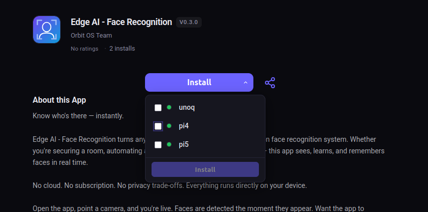
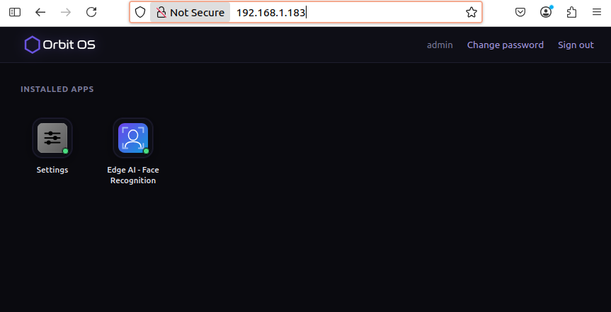

# Edge AI Without Docker: Real-Time Face Recognition on Raspberry Pi 5 and Arduino UNO Q

We ran real-time face recognition on two edge devices for over 26 hours. No cloud. No GPU server. No Docker. No containers of any kind. Everything local, on-device, in real time.

The numbers tell two stories — and one of them surprised us.

---

## The Project

The goal: local face recognition that runs entirely on the device. No frames leaving the device. No API calls to a cloud service. Face data never travels over a network.

Privacy enforced at the hardware level, not by policy.

We ran this using **Edge AI – Face Recognition**, an app available on the [Orbit OS Store](https://store.orbit-os.org) — the app store for [Orbit OS](https://orbit-os.org), an edge OS for embedded Linux that handles the platform layer so developers don't have to. Camera access, AI inference, process supervision, OTA updates — all built in.

The setup was straightforward: install Orbit OS on each device, create a Store account, and link the devices from Settings. All devices show up in the Store under your account. On any app page, the install button opens a dropdown listing all your registered devices — select which ones to install on, hit install, and the app is automatically deployed to each selected device. No SSH, no manual transfer, no configuration. The app installs as a signed `.orb` package (think APK, but for edge devices) and runs immediately.



Once installed, open a browser and go to `http://<device-ip>` to access the Launcher — the Orbit OS home screen for that device. After logging in, all installed apps are visible. The Edge AI – Face Recognition icon appears there immediately. Click it to open the app directly in the browser — no additional software needed.



We wrote the recognition logic. Orbit OS handled everything else — camera access, TFLite runtime, and process supervision.

The app weighs **6 MB** total — including three TFLite models for detection, landmark estimation, and identification.

---

## The Hardware

Two devices. Same app. No code changes between them.

| Device | SoC | CPU Core | RAM |
|---|---|---|---|
| Arduino UNO Q | Qualcomm QRB2210 | Cortex-A53 (Kryo 2.0), 4 cores @ 2016 MHz | 1.70 GB |
| Raspberry Pi 5 | Broadcom BCM2712 | Cortex-A76, 4 cores @ 2400 MHz | 7.87 GB |

**Camera used on both devices:** Logitech Brio 100 — live webcam feed at 640×480 (VGA).

---

## How It Works

The face recognition pipeline has three stages:

1. **Detection** — BlazeFace model locates faces in the camera frame
2. **Landmarks** — Face landmark model maps 468 facial keypoints
3. **Identification** — MobileFaceNet model matches against a known face embedding

All three TFLite models are bundled inside the `.orb` package. Orbit OS ships TFLite as part of the OS base — compiled in C++ with ARM NEON acceleration — so no app needs to bundle the runtime itself. That's why the package stays at 6 MB despite including three models.

One thing worth calling out: the app declares exactly what it needs in its manifest — `CameraService` and `AiService`. That's it. It has no `NetworkService` permission. Orbit OS enforces this at the runtime level — face data cannot leave the device even if the code tried to send it. Privacy isn't a setting, it's a consequence of the architecture.

```json
{
  "package_id": "org.orbit-os.service.face-recognition",
  "version": "0.3.0",
  "name": "Edge AI - Face Recognition",
  "permissions": [
    "CameraService/*",
    "AiService/*"
  ]
}
```

---

## The Results

Both devices had been running Orbit OS for approximately 26 hours before measurements were taken — comparable uptime, comparable steady state. We recorded metrics at idle, then again during live face recognition running continuously.

**Idle (before face recognition)**

| | Arduino UNO Q | Raspberry Pi 5 |
|---|---|---|
| CPU Usage | 2.4% | 0.2% |
| CPU Freq | 1305.6 MHz | 1500 MHz |
| RAM Used | 334.2 MB / 1.70 GB | 231.8 MB / 7.87 GB |
| Memory Usage | 26.3% | 4.5% |
| SoC Thermal | 32.5°C | 47.1°C |
| Uptime | 95,598s (~26h) | 95,650s (~26h) |

**Face Recognition (live webcam, 640×480)**

| | Arduino UNO Q | Raspberry Pi 5 |
|---|---|---|
| CPU Usage | 2.5% | 0.3% |
| CPU Freq | 2016 MHz | 2400 MHz |
| RAM Used | 453.9 MB / 1.70 GB | 353.7 MB / 7.87 GB |
| Memory Usage | 34.0% | 6.2% |
| SoC Thermal | 40.6°C | 60.1°C |
| Uptime | 96,138s (~26h) | 96,790s (~26h) |

**Delta (Face Recognition vs Idle)**

| | Arduino UNO Q | Raspberry Pi 5 |
|---|---|---|
| CPU Usage | +0.1% | +0.1% |
| CPU Freq | +710.4 MHz | +900.0 MHz |
| RAM Used | +119.7 MB | +121.9 MB |
| SoC Thermal | **+8.1°C** | **+13.0°C** |

---

## Two Lessons

### Lesson 1 — The platform overhead is almost zero

Look at the CPU delta: **+0.1%** on both devices.

Running three TFLite models continuously — detection, landmark estimation, identification — on a live camera feed, and the CPU load barely moves. The difference between idle and active face recognition is statistically invisible in the CPU usage column.

The RAM delta is more visible: around 120 MB on both devices. That's the three models loaded into memory — expected and fixed regardless of how long the app runs. No accumulating overhead, no memory leak, stable after the first frame.

This is what "no Docker, no container overhead, no heavyweight runtime" actually looks like in numbers. The `.orb` package contains only the app and the models. Orbit OS provides the TFLite runtime as part of the OS base. The CPU is free to do other things.

### Lesson 2 — The UNO Q runs cooler under load

Both devices show the same +0.1% CPU delta. But look at the temperature delta: the Raspberry Pi 5 gains **+13.0°C** under load. The Arduino UNO Q gains **+8.1°C**.

The RPi 5 also idles higher — **47.1°C** versus the UNO Q's **32.5°C** at rest.

This comes down to CPU architecture and dedicated silicon:

The Raspberry Pi 5 uses the **Cortex-A76** — a modern out-of-order superscalar core designed for peak throughput. It keeps multiple execution units busy simultaneously, speculates ahead, and is built to maximize performance. At maximum clock (2400 MHz), it draws more current and dissipates more heat.

The Arduino UNO Q uses the **Cortex-A53 (Qualcomm Kryo 2.0)** — a compact in-order core designed for energy efficiency. But more importantly, the QRB2210 integrates a **Dual DSP Core explicitly rated for lightweight AI inference tasks** — per the official Qualcomm datasheet. With TFLite's DSP delegate, inference offloads to dedicated silicon, leaving the Cortex-A53 cores virtually untouched.

The +8.1°C thermal delta confirms it — the heat is going somewhere other than the CPU cores. The DSP is doing the work.

For sustained AI workloads where inference runs continuously, architecture matters as much as clock speed. The UNO Q handles the same inference pipeline with less thermal output — which matters when you're deploying something that runs for days or weeks without interruption.

---

## What's Next

The natural next step for this project is a full **access control system** — combining face recognition with GPIO control. Face is recognized, GPIO fires, relay opens a door or gate. Everything still on-device, still offline, still under 10°C delta.

Orbit OS exposes GPIO through the same manifest model — apps declare what hardware they need and the runtime provides it. Adding relay control means adding `GpioService` to the permissions, wiring the relay to a GPIO pin, and writing the trigger logic. No new infrastructure, no cloud dependency, no additional deployment step.

The QRB2210 is also guaranteed until **May 2032** — relevant if you're deploying something that needs to run in the field for years.

That's the project we're building next. If you're already running this face recognition app and want to extend it in that direction, follow along on the forum.

---

## Try It Yourself — And Help Us Test the SDK

The **Go SDK** is launching next month. If you're a developer interested in building apps for edge devices — or just want to try real-time embedded development without Docker — we're looking for early testers.

What early access means in practice: you get the SDK before public release, you can build and deploy `.orb` packages to real hardware, and your feedback directly shapes what ships. No Docker. No SSH. Your code runs on your laptop and calls device APIs over the network — GPIO, AI inference, camera, networking — through the same API that production apps use.

If you're interested:
- Join the forum at [forum.orbit-os.org](https://forum.orbit-os.org)
- Browse the Store at [store.orbit-os.org](https://store.orbit-os.org)
- Follow the project at [orbit-os.org](https://orbit-os.org)

We're a team of three. The Community Edition launches next month on Raspberry Pi 3/4/5/Zero 2W and Arduino UNO Q. We'd love early testers who aren't afraid to break things and tell us what's wrong.

